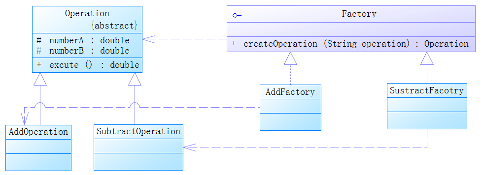

# 工厂方法模式


### 1. 示例

依旧是计算器进行加减乘除等运算操作，利用工厂方法模式获取运算操作类。将原来的简单工厂改造成工厂方法。



代码中变成：

```java
Factory factory = new AddFacotry();
AddOperation add = factory.createOperation("add");
```


### 2. UML类图


### 3. 工厂方法模式 

定义一个用于创建对象的接口，让子类决定实例化哪一个类。工厂方法使一个类的实例化延迟到其子类。

#### 优点

工厂方法模式解决了简单工厂模式违背“开闭原则”的问题，将简单工厂的内部逻辑判断移到了客户端代码来进行，同时保留简单工厂降低耦合度的优点。

#### 缺点

实现略复杂，并且如果产品过多，维护起来也困难。

