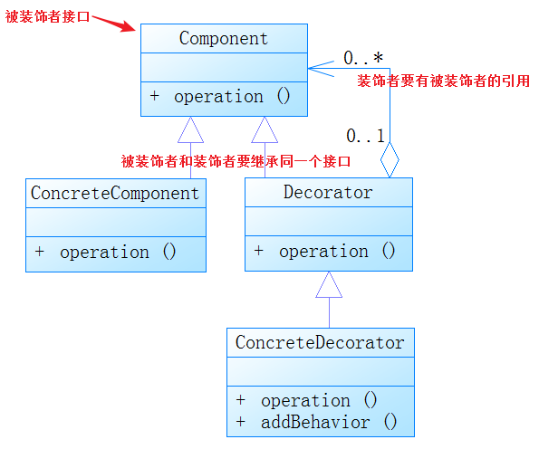

# 装饰模式

### 1. UML类图

### 2. 装饰模式

动态地向一个现有的对象增加新的功能，同时又不改变其原有的结构，符合开闭原则。例如：Java I/O

#### 优点

动态地增加功能，而不修改现有类的结构，将类的核心职责和装饰功能区分开了，可以去除类中重复的装饰逻辑。

#### 缺点

会产生很多装饰对象，增加复杂性，同时因为更灵活，也更容易出错，对于多次装饰的对象，排错困难。