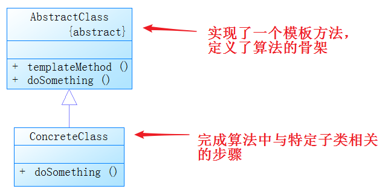

# 模板方法模式

### 1. UML类图

### 2. 模板方法模式

定义一个操作中的算法的骨架，而将一些步骤延迟到子类中实现。模板方法使得子类可以不改变一个算法的结构即可重定义该算法的某些特定步骤。

可提供hook方法（钩子函数）是模板方法的应用更加灵活，使得具体的子类可以自行决定是否挂钩以及如何挂钩。

模板方法是final

**优点**：封装性好、复用性好、屏蔽细节、便于维护

**缺点**：继承

**使用场景**：重构时，抽取出通用的部分到模板类中。设计项目时，核心算法设计为模板算法。