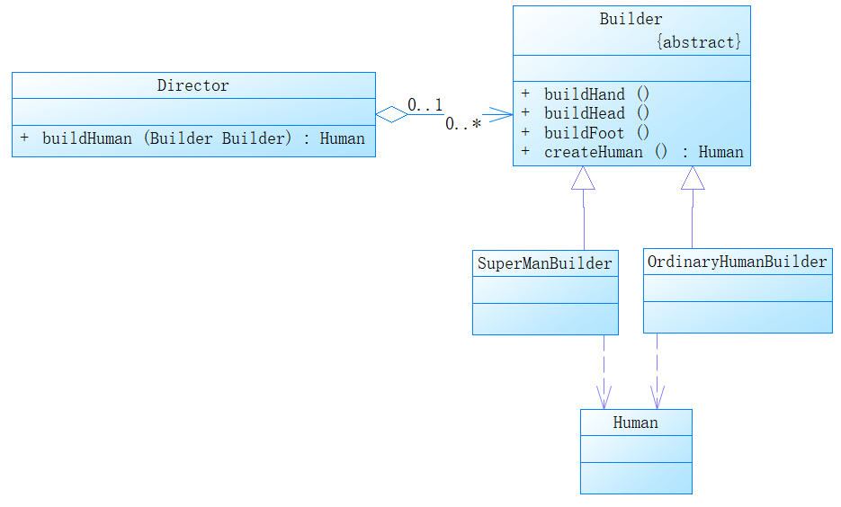

# 🔺建造者模式

### 1.UML类图

### 2.建造者模式

将一个复杂对象的构建与他的表示分离，使得同样的构建可以创建不同的表示。

建造者模式中的Builder时为创建一个产品对象的各个部件指定的接口。具体实现则是放在具体的Builder实现类中。其中Director是一个指挥者，根据调用者的需求来构建匹配的对象并返回给调用者。

**优势**：使得建造对象的代码与表示代码分离，客户端不必知道产品内部的实现细节，将产品本身与产品的创建过程解耦，使得相同的调用可以创建不同的产品对象。并且增加新的具体建造者无须修改原有类库的代码，指挥者类针对抽象建造者类编程，系统扩展方便，符合“开闭原则”  

**缺点**：建造者模式创建的产品一般具有较多共同点，不适合差异性较大的产品。

**场景**：比如和工厂模式结合，使用建造者模式来构造出工厂。mybatis就是这么做的，通过`new SqlSessionFactoryBuilder().build(inputStream);`来构造SqlSessionFactory的实例。