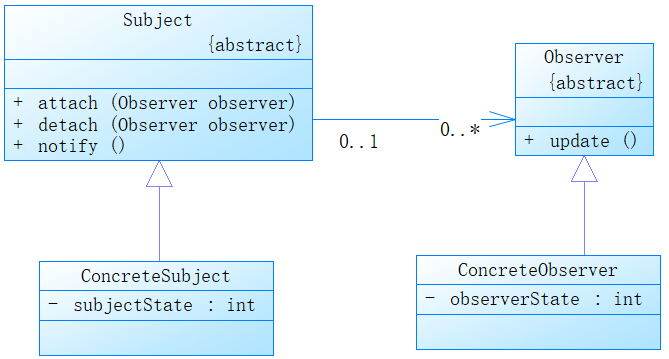

# 观察者模式

### 1. UML类图

### 2. 观察者模式

也称发布-订阅模式，定义了一对多得依赖关系，让多个观察者对象同时监听某一个主题对象。这个主题对象在状态发生变化时，会通知所有观察者对象，更新观察者的状态。

**优点**：定义了稳定的消息更新传递机制，抽象了更新接口，使得可以有各种各样不同的表示层作为具体观察者角色，也支持广播通信，符合“开闭原则” 。

**缺点**：如果一个观察目标对象有很多直接和间接的观察者的话，将所有的观察者都通知到会花费很多时间。 如果在观察者和观察目标之间有循环依赖的话，观察目标会触发它们之间进行循环调用，可能导致系统崩溃。 

**场景**：消息队列