> 本篇将介绍各种查询语句优化，包括join、in\exist、order by、group by、limit、distinct等。

# 一、Join语句

### 1. 7种Join查询

1. select * from A a inner join B b on a.key = b.key;

   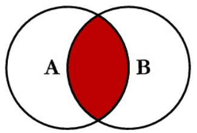

   ​

2. select * from A a left join B b on a.key = b.key;

   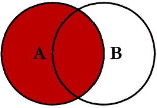


3. select * from A a right join B b on a.key = b.key;

   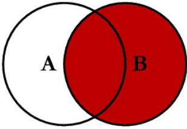

   ​

4. select * from A a left join B b on a.key = b.key where b.key is NULL;

   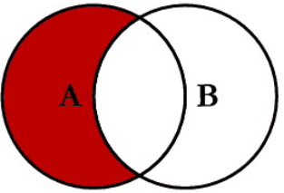

   ​

5. select * from A a left join B b on a.key = b.key where a.key = NULL;

   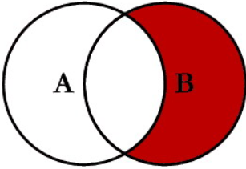

   ​

6. select * from A a left join B b on a.key = b.key

   union

   select * from A a right join B b on a.key = b.key;

   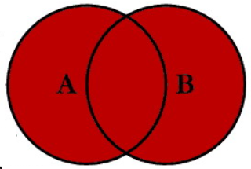

   ​

7. (select * from A a left join B b on a.key = b.key

   union

   select * from A a right join B n on a.key = b.key)

   where a.key is NULL or b.key is NULL;

   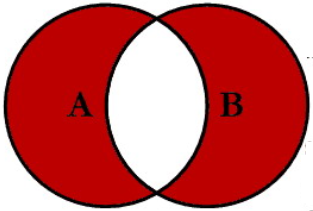

### 2. Join语句优化

1. 单表查询优化

   案例：SELECT id,author_id FROM article WHERE category_id = 1 AND comments > 1 ORDER BY views DESC LIMIT 1;

   `第一次` 直接查询的结果：

   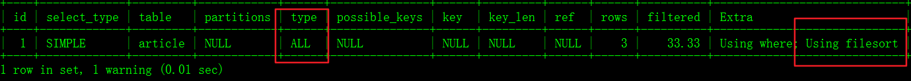

   结论：

   很显然,type 是 ALL,即最坏的情况。Extra 里还出现了 Using filesort,也是最坏的情况。优化是必须的。

   ​

   `第二次` 对所有查询条件建立复合索引：

   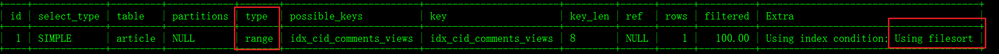

   结论：

   type 变成了 range,这是可以忍受的。但是 extra 里使用 Using filesort 仍是无法接受的。

   但是我们已经建立了索引,为啥没用呢？

   这是因为按照 BTree 索引的工作原理,先排序 category_id,如果遇到相同的 category_id 则再排序 comments,如果遇到相同的 comments 则再排序 views。当 comments 字段在联合索引里处于中间位置时,因comments > 1 条件是一个范围值(所谓 range),MySQL 无法利用索引再对后面的 views 部分进行检索,即 range 类型查询字段后面的索引无效。

   ​

   `第三次` 重建索引 对category_id 和views 字段建立复合索引：

   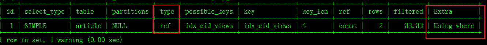

   结论：type 变为了 ref,Extra 中的 Using filesort 也消失了,结果非常理想。

   ​

2. 双表关联查询优化

   案例：`左外连接` SELECT * FROM class LEFT JOIN book ON class.card = book.card;

   `第一次` 直接查询的结果：

   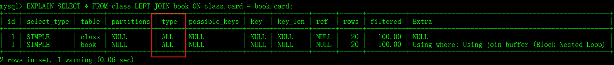

   结论：type 为All，全表扫描，出现using join buffer

   ​

   `第二次` 左边表class的card字段上建索引：

   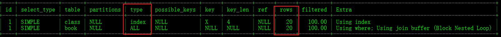

   结论：事实证明，左连接加右表，左表确定全有，右表不确定。

   ​

   `第三次` 右边表book的card字段上建索引：

   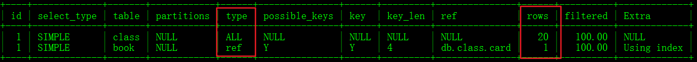

   结论：可以看到第二行的 type 变为了 ref,rows 也变成了优化比较明显。

   这是由左连接特性决定的。LEFT JOIN 条件用于确定如何从右表搜索行,左边一定都有,所以右边是我们的关键点,一定需要建立索引。

   ​

3. 三表关联查询优化

   案例：SELECT * FROM class LEFT JOIN book ON class.card = book.card LEFT JOIN phone ON book.card = phone.card;

   `第一次` 直接查询的结果：

   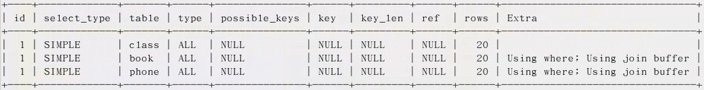

   `第二次` 两个被驱动表（右边表book、phone）各加上索引：

   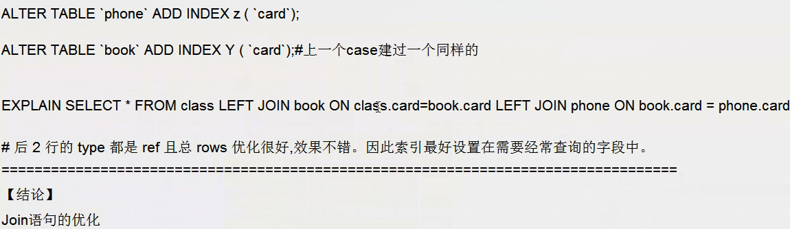

   ​

4. 优化建议

   1、保证Join语句中被驱动表上Join条件字段已经被索引

   被驱动表：left join 右边的表为被驱动表 。

   2、left join 时，选择小表作为驱动表，大表作为被驱动表

   尽可能减少Join语句中的NestedLoop的循环总次数，“永远用小结果集驱动大的结果集”。

   3、优先优化嵌套循环的内层循环

   子查询尽量不要放在被驱动表，有可能使用不到索引。若必须用到子查询，可将子查询设置为驱动表，因为驱动表的type 肯定是 all，而子查询返回的结果表没有索引，必定也是all。

   4、inner join 时，mysql会自动帮你把小结果集的表选为驱动表

   5、当无法保证被驱动表的Join条件字段被索引且内存资源充足的前提下，增加JoinBuffer的大小

# 二、用in还是用exist？

### 强调：小表驱动大表 

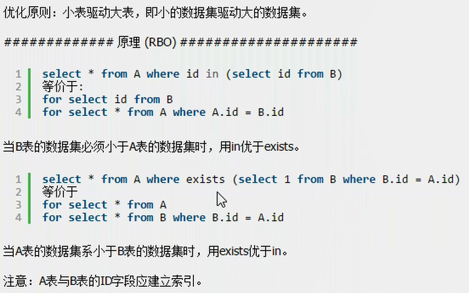

# 三、Order By 优化

### 1. ORDER BY子句，尽量使用Index方式排序，避免FileSort

MySQL支持二种方式的排序，FileSort和Index，Index效率高。它指MySQL扫描索引本身完成排序。FileSort方式效率较低。

ORDER BY满足两情况，会使用Index方式排序：

ORDER BY 语句符合索引最左前缀原则。使用Where子句与Order BY子句条件列组合满足索引最左前列。where子句中如果出现索引的范围查询(即explain中出现range)会导致order by 索引失效。

示例：CREATE INDEX idx_A_ageBirth ON tblA(age,birth,name);

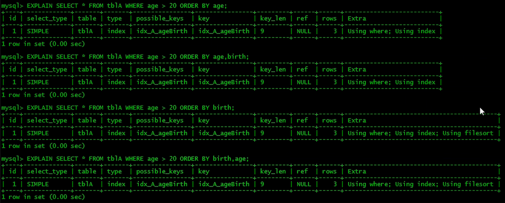

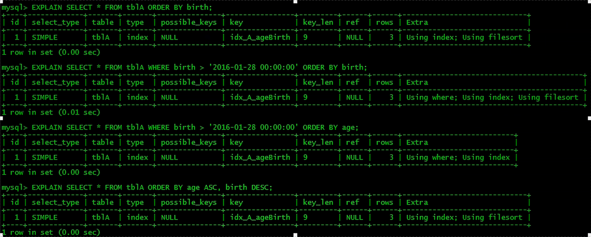

### 2.  如果不在索引列上，filesort有两种算法：mysql就要启动双路排序和单路排序

1、双路排序

MySQL 4.1之前是使用双路排序，字面意思就是两次扫描磁盘，最终得到数据，
读取行指针和orderby列，对他们进行排序，然后扫描已经排序好的列表，按照列表中的值重新从列表中读取对应的数据输出。从磁盘取排序字段，在buffer进行排序，再从磁盘取其他字段。

2、单路排序

从磁盘读取查询需要的所有列，按照order by列在buffer对它们进行排序，然后扫描排序后的列表进行输出，它的效率更快一些，避免了第二次读取数据。并且把随机IO变成了顺序IO，但是它会使用更多的空间，因为它把每一行都保存在内存中了。

3、单路排序存在的问题

在sort_buffer中，方法B比方法A要多占用很多空间，因为方法B是把所有字段都取出, 所以有可能取出的数据的总大小超出了sort_buffer的容量，导致每次只能取sort_buffer容量大小的数据，进行排序（创建tmp文件，多路合并），排完再取取sort_buffer容量大小，再排……从而多次I/O。

本来想省一次I/O操作，反而导致了大量的I/O操作，反而得不偿失。

4、优化策略

增大sort_buffer_size参数的设置。用于单路排序的内存大小。

增大max_length_for_sort_data参数的设置。单次排序字段大小。(单次排序请求)。

去掉select 后面不需要的字段。select 后的多了，排序的时候也会带着一起，很占内存，所以去掉没有用的。

### 3. 尽可能在索引列上完成排序操作，遵照索引建的最佳左前缀

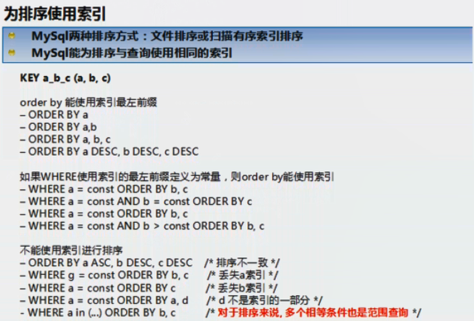

# 四、Group By优化

### 1. 注意点

group by实质是先排序后进行分组，遵照索引建的最佳左前缀。

当无法使用索引列，增大max_length_for_sort_data参数的设置+增大sort_buffer_size参数的设置。

where优于having，能写在where限定的条件就不要去having限定了。

### 2. 其它

Group By排序方面的处理与Order By类似，这里不再赘述。

# 五、Limit优化

### 1. 案例

常规：

```sql
SELECT  SQL_NO_CACHE * FROM emp  ORDER  BY  deptno   LIMIT 10000,40;
```

子查询优化：

先利用覆盖索引把要取的数据行的主键取到，然后再用这个主键列与数据表做关联：(查询的数据量小了后)

```sql
SELECT SQL_NO_CACHE * FROM emp INNER JOIN (SELECT id FROM emp e ORDER BY deptno LIMIT 10000,40) a ON a.id=emp.id;
```

# 六、去重优化

尽量不要使用 distinct 关键字去重，用 distinct 关键字去重消耗性能。

### 1. 案例

```sql
select distinct kcdz form t_mall_sku where id in( 3,4,5,6,8 );
```

优化：

kcdz字段上建立索引，利用索引来优化。

```sql
select  kcdz form t_mall_sku where id in( 3,4,5,6,8 )  group by kcdz;
```


